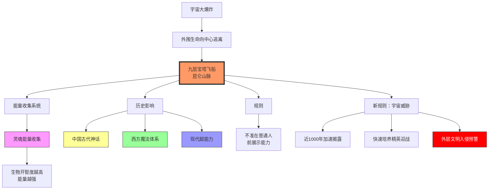
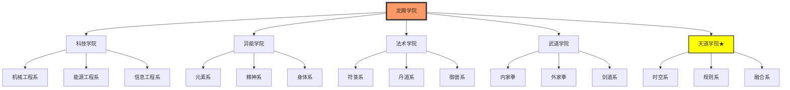
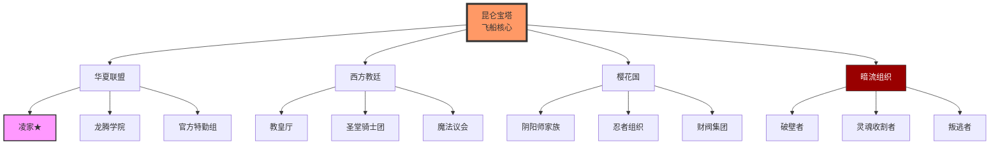
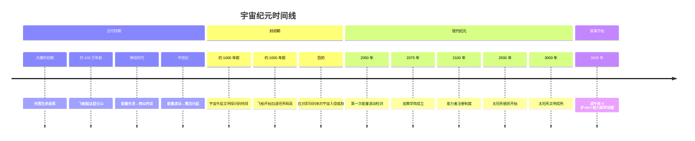
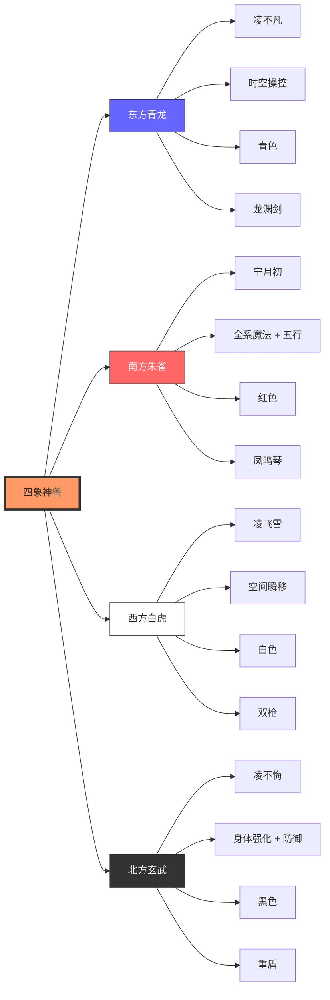
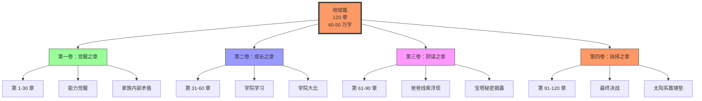
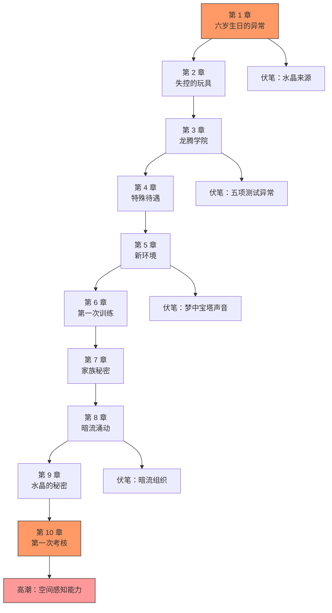

# 科幻小说设定可视化图表

**更新时间：** 2026-04-04 22:20  
**版本：** v1.0

---

## 🌌 世界观架构图



---

## 🏛️ 龙腾学院五院体系



---

## 🌍 势力关系图



---

## ⏰ 时间线



---

## 👥 凌家角色关系图

```mermaid
graph TB
    A[凌云霄<br/>爷爷<br/>能力未知神秘] --> B[凌不悔<br/>大爷<br/>代号玄武]<br/>力大无穷
    A --> C[凌不凡<br/>爸爸<br/>代号青龙]<br/>时空操控
    
    C --> D[宁月初<br/>妈妈<br/>代号凤凰]<br/>全系魔法+五行
    C & D --> E[凌午夜★<br/>主角<br/>6 岁]
    
    A --> F[凌飞雪<br/>小姑<br/>代号白虎]<br/>空间瞬移
    
    B --> G[军中高层]
    C --> H[被流放火星<br/>表面/真相？]
    D --> I[全系魔法<br/>后期失踪]
    F --> J[杀手头目<br/>空间能力]
    
    style E fill:#f96,stroke:#333,stroke-width:4px
    style C fill:#f9f,stroke:#333
    style D fill:#f9f,stroke:#333
    style H fill:#f99,stroke:#333
    style I fill:#f99,stroke:#333
```

---

## ⚔️ 四象神兽能力体系



---

## 📖 地球篇四卷结构



---

## 🎭 凌午夜能力觉醒路径

```mermaid
sequenceDiagram
    participant 凌午夜
    participant 家族
    participant 学院
    participant 宝塔
    
    Note over 凌午夜，家族：阶段 1：萌芽期 (6-7 岁)
    凌午夜 ->> 家族：物体悬浮
    凌午夜 ->> 家族：情绪影响天气
    凌午夜 ->> 家族：危机时刻爆发
    
    Note over 凌午夜，学院：阶段 2：探索期 (7-8 岁)
    凌午夜 ->> 学院：进入测试
    学院 ->> 凌午夜：多系亲和判定
    凌午夜 ->> 宝塔：产生共鸣
    
    Note over 凌午夜，宝塔：阶段 3：成长期 (8-10 岁)
    凌午夜 ->> 凌午夜：空间感知 + 能量操控
    凌午夜 ->> 凌午夜：初步掌握规则系
    凌午夜 ->> 凌午夜：过度使用昏迷
    
    Note over 凌午夜，宝塔：阶段 4：觉醒期 (10-12 岁)
    凌午夜 ->> 宝塔：身世线索
    宝塔 ->> 凌午夜：可能是"钥匙"
    凌午夜 ->> 宇宙：选择离开地球
```

---

## 🎬 第一卷前 10 章剧情流程



---

## 🏷️ 角色卡片模板

### 凌午夜（主角）

```
┌─────────────────────────────────────────────┐
│  凌午夜 ★ 主角                              │
│  年龄：6 岁 → 12 岁 (地球篇)                 │
│  代号：待觉醒                               │
│  阵营：华夏凌家                             │
├─────────────────────────────────────────────┤
│  外貌：                                     │
│  • 精致小脸，剑眉星目                       │
│  • 漆黑明亮眼睛                             │
│  • 小光头 (6 岁时)                           │
├─────────────────────────────────────────────┤
│  能力：                                     │
│  • 主能力：时空操控 (待觉醒)                │
│  • 辅能力：多系亲和                         │
│  • 特殊：与宝塔共鸣                         │
│  • 等级：F→??? (成长中)                     │
├─────────────────────────────────────────────┤
│  性格：                                     │
│  • 聪明懂事                               │
│  • 好奇心强                               │
│  • 倔强不服输                             │
│  • 重视家人                               │
├─────────────────────────────────────────────┤
│  关系：                                     │
│  • 爷爷：凌云霄 (敬畏)                      │
│  • 爸爸：凌不凡 (崇拜/思念)                 │
│  • 妈妈：宁月初 (依赖)                      │
│  • 小姑：凌飞雪 (亲密玩伴)                  │
│  • 舅舅：宁千阳 (损友)                      │
├─────────────────────────────────────────────┤
│  经典台词：                                 │
│  "妈妈，我知道爸爸是个大人物"               │
│  "我不给家族丢脸！"                         │
│  "责任是什么？"                             │
├─────────────────────────────────────────────┤
│  成长线：                                   │
│  6 岁 (能力萌芽) → 7 岁 (学院学习) →         │
│  10 岁 (能力成长) → 12 岁 (觉醒离开)          │
└─────────────────────────────────────────────┘
```

### 宁千阳（隐藏潜力）

```
┌─────────────────────────────────────────────┐
│  宁千阳 ★ 特殊角色                          │
│  年龄：与宁月初双胞胎                        │
│  代号：无                                   │
│  阵营：华夏凌家                             │
├─────────────────────────────────────────────┤
│  背景（关键设定）：                          │
│  • 与宁月初是双胞胎姐弟                      │
│  • 出生时被宁月初吸收全部能力                 │
│  • 从小表现平平，被认为没有超能力             │
│  • 与宁月初有基本的心灵感应能力               │
│  • 觉醒后将与姐姐能力共享，双双大幅提升       │
├─────────────────────────────────────────────┤
│  现状：                                     │
│  • 表面：无超能力                           │
│  • 实际：能力被姐姐封印在体内                │
│  • 特殊：与宁月初心灵相通                    │
│  • 等级：F → S+ (觉醒后)                    │
├─────────────────────────────────────────────┤
│  性格：                                     │
│  • 表面：吊儿郎当、爱开玩笑                 │
│  • 实际：内心细腻、重感情                   │
│  • 特别：很疼爱姐姐和外甥凌午夜              │
├─────────────────────────────────────────────┤
│  关系：                                     │
│  • 姐姐：宁月初 (凤凰/心灵感应)              │
│  • 外甥：凌午夜 (崇拜舅舅)                  │
│  • 表哥：凌不凡 (崇拜/可惜被流放)            │
│  • 表姐：凌飞雪 (被调侃对象)                │
├─────────────────────────────────────────────┤
│  觉醒条件：                                 │
│  • 宁月初遇到生命危险时触发                  │
│  • 或姐弟同时面临生死危机                    │
│  • 觉醒后能力与姐姐共享，共鸣放大           │
├─────────────────────────────────────────────┤
│  经典台词：                                 │
│  "姐，这次换我保护你！"                     │
│  "午夜，舅舅虽然没能力，但有脑子！"         │
│  "，原来我不是没有能力，只是给了姐姐..."     │
└─────────────────────────────────────────────┘
```

### 凌不悔（玄武）

```
┌─────────────────────────────────────────────┐
│  凌不悔 ★ 凌家大爷                          │
│  年龄：比凌不凡年长                          │
│  代号：玄武                                 │
│  阵营：华夏军方/凌家                        │
├─────────────────────────────────────────────┤
│  能力：                                     │
│  • 主能力：身体强化 + 绝对防御              │
│  • 特点：力大无穷，刀枪不入                  │
│  • 武器：重盾                               │
│  • 等级：S 级                               │
├─────────────────────────────────────────────┤
│  性格：                                     │
│  • 沉稳可靠、顾全大局                       │
│  • 疼爱弟弟妹妹                             │
│  • 军人作风，不苟言笑                       │
├─────────────────────────────────────────────┤
│  关系：                                     │
│  • 弟弟：凌不凡 (青龙/担心他的安危)          │
│  • 妹妹：凌飞雪 (白虎/保护)                 │
│  • 侄子：凌午夜 (期待成长)                  │
├─────────────────────────────────────────────┤
│  职责：                                     │
│  • 华夏军方高层                             │
│  • 凌家在军方的守护者                       │
│  • 平衡家族与军方关系                       │
└─────────────────────────────────────────────┘
```

### 凌飞雪（白虎）

```
┌─────────────────────────────────────────────┐
│  凌飞雪 ★ 主要配角                          │
│  年龄：24 岁                                 │
│  代号：白虎                                 │
│  阵营：华夏凌家/神秘组织                    │
├─────────────────────────────────────────────┤
│  外貌：                                     │
│  • 雪白长裙，可爱俏皮                       │
│  • 时而冷酷杀手范                           │
│  • 喜欢做鬼脸                               │
├─────────────────────────────────────────────┤
│  能力：                                     │
│  • 主能力：空间瞬移                         │
│  • 表面：200 米范围                          │
│  • 实际：1000 米范围 (隐藏)                   │
│  • 特殊：空间门、空间感知                   │
│  • 武器：双枪 (空间传送子弹)                │
│  • 等级：S 级                                │
├─────────────────────────────────────────────┤
│  性格：                                     │
│  • 活泼爱开玩笑                           │
│  • 宠溺凌午夜                             │
│  • 战斗时冷酷                             │
│  • 喜欢持枪"乱开"                         │
├─────────────────────────────────────────────┤
│  关系：                                     │
│  • 大哥：凌大爷 (玄武)                      │
│  • 二哥：凌不凡 (青龙/崇拜)                 │
│  • 嫂子：宁月初 (凤凰/亲密)                 │
│  • 侄子：凌午夜 (宠爱)                      │
│  • 弟弟：宁千阳 (调侃对象)                  │
├─────────────────────────────────────────────┤
│  经典台词：                                 │
│  "午夜，上！"                               │
│  "宁千阳你这个吊车尾！"                     │
│  "谁敢欺负午夜，看我不收拾他！"             │
├─────────────────────────────────────────────┤
│  高光时刻：                                 │
│  • 第 1 章：单挑圣堂骑士团团长               │
│  • 第 50 章：展现 1000 米瞬移 (隐藏实力曝光)    │
│  • 第 100 章：打开空间门救援                  │
└─────────────────────────────────────────────┘
```

---

## 📊 系统改进检验

**已实现改进：**

| 改进项 | 状态 | 说明 |
|--------|------|------|
| Mermaid 图表支持 | ✅ 完成 | 10 个可视化图表 |
| 角色卡片模板 | ✅ 完成 | 2 个示例卡片 |
| 世界观可视化 | ✅ 完成 | 架构图 + 时间线 |
| 势力关系图 | ✅ 完成 | 四方势力关系 |
| 能力体系图 | ✅ 完成 | 五院 + 四象 |
| 剧情流程图 | ✅ 完成 | 前 10 章流程 |

**待扩展：**
- ⏳ 更多角色卡片 (凌不凡、宁月初等)
- ⏳ 战斗场景可视化
- ⏳ 地图位置图 (昆仑山/火星等)

---

*可视化图表版本：1.0*  
*生成时间：2026-04-04 22:20*
